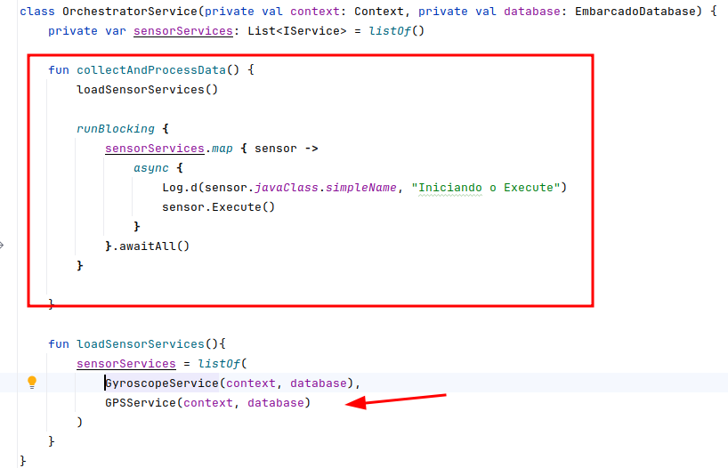
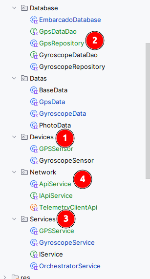
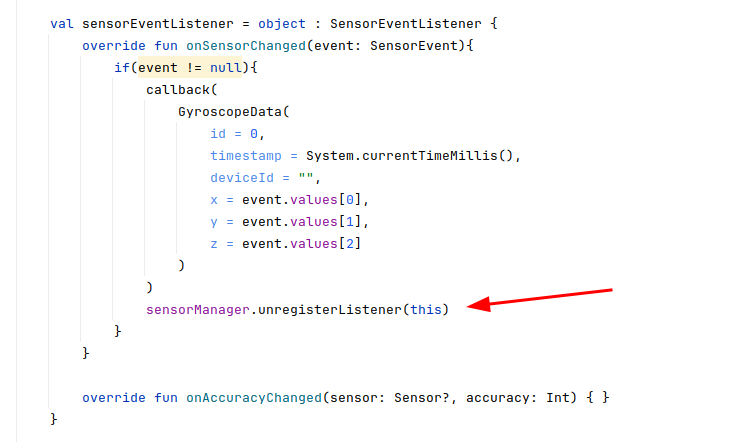
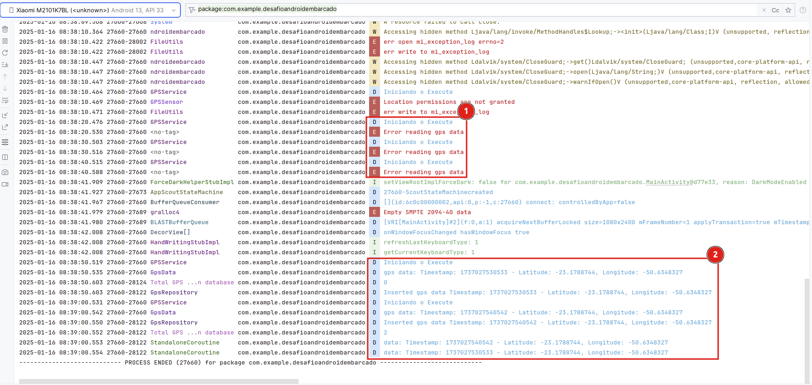
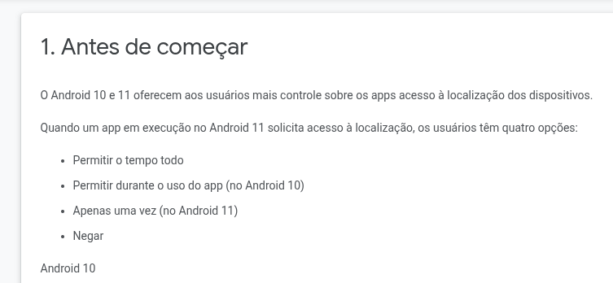

# Como foi desenvolvido o desafio
Opa, e aí blz? 

Neste documento, compartilho como desenvolvi o teste técnico que, além de interessante, se mostrou desafiador. Convido você a conhecer um pouco sobre minha abordagem para resolver problemas...

## Primeiras impressões

Desde o início, achei o teste muito bem elaborado: simples, mas capaz de explorar um vasto conjunto de conhecimentos em diferentes níveis.

Apesar de ser um desafio em **Kotlin**, não vi isso como um impedimento. Acredito que uma boa base de lógica de programação e compreensão de funcionamento de máquinas facilita a adaptação entre linguagens.

Já tive experiências com comunicação com sensores em outra linguagem, como **React Native**, o que me deu uma ideia do que esperar ao trabalhar nesse cenário. Além disso, minha experiência com **Orientação a Objetos** influenciou a abordagem inicial. Comecei utilizando herança e uma **Factory** para gerenciar as classes, mas logo percebi que **Kotlin** favorece uma abordagem mais orientada à **Programação Funcional**. Com isso, ajustei minha estratégia para melhor aproveitar os recursos da linguagem.

## Abordagem

Comecei com uma abordagem de orquestração uma service concentraria a função de execução do core do MVP que seria o monitoramento, deixando então cada serviço com as suas funções particulares para serem implementadas

### Como orquestrar a solução

Em uma primeiro contato a idéia inicial seria utilizar o **Strategy Pattern** para manter um padrão **SOLID** e no futuro qualquer adção de novos monitoramentos se tornarem mais fáceis sem impactar o que já existe.
Foi estabelecido então a interface IService e cada classe implementa seu próprio **Execute** que deve fazer a captura, salvar em banco de dados, comunicar com api, e qualquer outra atribuição que seja particular de cada monitoramento

Abaixo temos a orquestração deste serviço:

Dessa forma temos a execução acontecendo em paralelo de cada serviço com suas particularidades, para novas implementações basta implementar e adicionar a nova funcionalidade no método loadSensorServices.

### Separação das responsabilidades

A nível de testes foi escolhido uma separação funcional na estrutura, talvez um ambiente de produção uma abordagem separando por funções seja mais interessante para manutenção.

Desta forma temos a seguinte separação:
1. **Devices** - para a comunicação com os sensores
2. **Database** - para a manipulação do banco de dados local
3. **Services** - para orquestrar as rotinas de monitoramento particulares de cada recurso a ser monitorado
4. **Network** - devido as poucas requisições a serem implementadas, não houve necessidade de separação por tipo de monitoramento, porém não impede a separação em um futuro

## Desafios superados

### Giroscópio
A leitura do giroscópio não se mostrou com grandes impedimentos em um primeiro momento, utilizando a leitura contínua.

Visando economizar recursos do dispositivo, após configurar a leitura a cada 10 segundos, apresentou o primeiro desafio, onde a comunicação com o giroscópio se perdia após algumas sucessões de leituras do mesmo (aproximadamente 30 leituras).

A abordagem utilizada para resolver esse desafio, foi forçar a parada de escuta após a leitura:

### GPS
Em um primeiro momento houve uma tentativa de utilizar o **LocationManager**, porém o mesmo se demonstrou capturando as coordenadas apenas quando havia mudanças de posição, com o dispositivo parado, não havia captura.

Acreditando que para momentos em que o condutor poderia estar abastecendo ou em uma parada real, a não captura poderia, tendenciar os resultados analisados, foi então alterado a abordagem para utilizar outra forma de captura:
**FusedLocationProviderClient** que oferece uma captura mesmo o dispositivo estando parado.

Após ajustar a captura dos dados do GPS foi encontrado um problema, o GPS só é capturado enquanto o App estiver aberto, conforme demonstrado abaixo no item 1 é como o app fechado e o item 2 é com o app aberto:

Depois de verificar, esse impedimento vem de um recurso de segurança da informação nos Androids de versão acima da 10, conforme a documentação :

Link da doc:
https://codelabs.developers.google.com/codelabs/while-in-use-location?hl=pt-br#3

Porém a opção que permite disponível é apenas, "Durante o uso do App".

## Deficts técnicos

Como acontece na rotina de desnvolvimento o prazo acabou sendo estourado e alguns déficts ficaram para trás.

### Testes
Devido a nova linguagem e como a abordagem de comunicação com os sensores foi feito de forma exploratória, fazer testes "Caixa Preta" não seriam viáveis, portanto foi estimado realizar testes "Caixa Branca" para testar as funionalidades e comunicações, porém devido ao prazo ter se extendido, os mesmos não foram implementados

### Camera
Os demais sensores exigiram alguns desafios a serem superados, portanto a camera ficou como défcit técnico, porém a estrutura de desenvolvimento deixa um tanto quanto mais fácil abordar a integração desse monitoramento no futuro

### Api
A estrutura da API está pronta, porém não funcional, em todos os testes tentando realizar a comunicação esperando um erro de timetout, porém uma exceção no momento da criação da Api é lançado, precisa verificar esse bug

## Considerações

O teste foi uma experiência rica e desafiadora, com um nível de complexidade adequado. Sugiro, no entanto, uma revisão relacionada às permissões de LGPD, considerando as versões mais recentes do Android.

No aspecto pessoal, o teste me ajudou a evoluir como desenvolvedor, especialmente no que diz respeito aos desafios com dispositivos móveis. Mesmo que eu não use Kotlin no futuro, me sinto mais preparado para lidar com problemas de comunicação com sensores.

Essa experiência reforça minha visão de que a tecnologia deve facilitar a vida das pessoas e trazer melhorias reais. Meu foco é sempre no impacto positivo para o usuário final. Gostei muito do desafio e espero que meu estilo de resolução de problemas esteja alinhado às expectativas da V3. Acredito que este projeto tem potencial para beneficiar muitas pessoas!