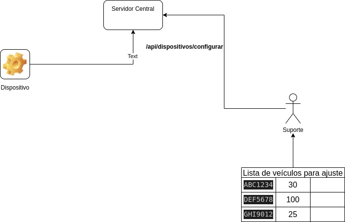

# Desafio V3

## 💡 Justificativa da Escolha por Shell Script

Optei por utilizar **Shell Script** como solução principal para este desafio por uma combinação de fatores técnicos e práticos:

### ✅ Simplicidade e Agilidade

Shell Script é ideal para automação de tarefas em sistemas Unix-like, ou mesmo Windows (`WSL`), principalmente quando:

- As operações envolvem leitura e processamento de arquivos (`CSV` neste caso).
- A interação com serviços externos (via `curl`) pode ser feita com comandos diretos.
- Não há necessidade de estruturar uma aplicação complexa com múltiplos arquivos ou dependências.

Por isso, a escolha foi orientada por **simplicidade**, **baixo overhead** e **velocidade de execução e entrega**.

### ⚙️ Facilidade de Uso

Outro fator importante foi a **facilidade de execução**:  
O script é executável diretamente em qualquer sistema com `bash`, sem necessidade de compilar ou instalar bibliotecas externas, o que torna o processo mais acessível e portátil.

### 🤖 Uso de Inteligência Artificial com Prompt Engineering

Para acelerar a criação do script, utilizei técnicas de **Prompt Engineering** com ferramentas de IA (como o ChatGPT e DeepSeek), visando:

- Ganhar tempo em trechos repetitivos e padrões de validação.
- Obter sugestões baseadas em boas práticas modernas (como tratamento de erros, logs, paralelismo).
- Aumentar a produtividade sem comprometer a qualidade.

**Entretanto, vale destacar:** toda sugestão gerada foi **criteriosamente revisada**, adaptada ao contexto real do desafio e **melhorada conforme necessário**.  
A IA foi usada como uma aliada técnica, mas a responsabilidade pela solução final — incluindo padrões, segurança e clareza — foi minha.

### 🧼 Boas Práticas Utilizadas

- Validação de entrada (placa, volume).
- Tratamento de erros de conexão com o servidor.
- Execução paralela com controle de processos.
- Logs com timestamps para auditoria.
- Separação clara de responsabilidades no código.

---

## 📄 Conclusão

Escolher Shell Script foi uma decisão consciente, técnica e alinhada com os objetivos do desafio.  
Quando buscamos **eficiência e portabilidade**, soluções simples e bem escritas costumam ser as mais eficazes.

> __Atenção__ Eu quebrei o desafio conforme as sugestões dos níveis. Cada nível possui uma pasta própria onde se encontra os passos necessários para cada execução.

Arquitetura geral do Desafio:

## Um pouco mais

Além dos desafios eu implementei uma aplicação python para servir de aplicação servidora para simular o servidor que comanda os dispositivos.
Mais informações podem ser encontradas [aqui](./servidor/dispositivo_config/README.md).

Espero ter atendido as expectativas para a vaga e fico no aguardo de um retorno. Obrigado pela oportunidade! <3