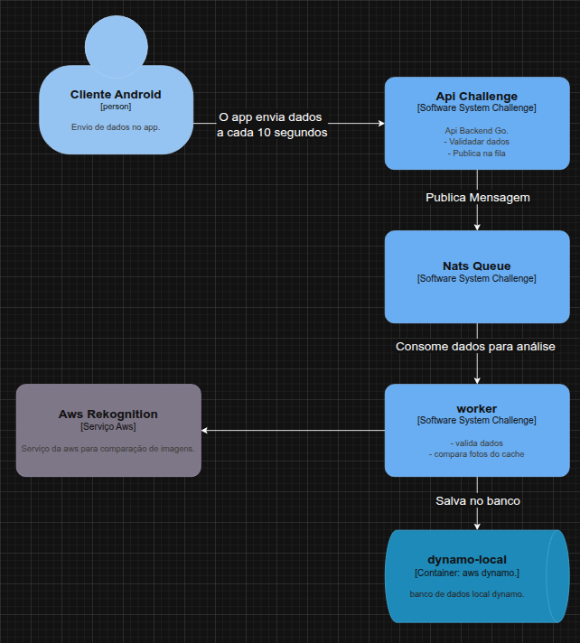

<h1 align="center" style="font-weight: bold;">Desafio Técnico Cloud da V3</h1>

## 💻 O Problema

Um dos nossos clientes ainda não consegue comprar o equipamento para colocar nos veículos de sua frota, mas ele quer muito utilizar a nossa solução.

Por isso, vamos fazer um MVP bastante simples para testar se, o celular do motorista poderia ser utilizado como o dispositivo de obtenção das informações.

> Parece fazer sentido certo? Ele possui vários mecanismos parecidos com o equipamento que oferecemos!

Sua missão ajudar na criação deste MVP para que possamos testar as frotas deste cliente.

Essa versão do produto será bastante simplificada. Queremos apenas criar as estruturas para obter algumas informações do seu dispositivo (Android) e armazená-la em um Banco de Dados.

Essas informações, depois de armazenadas devem estar disponíveis através de uma API para que este cliente integre com um Front-end já existente!

### Quais serão as informações que deverão ser coletadas?

1. **Dados de Giroscópio** - Estes dados devem retornar 3 valores (`x`, `y`, `z`). E devem ser armazenados juntamente com o `TIMESTAMP` do momento em que foi coletado;
2. **Dados de GPS** - Estes dados devem retornar 2 valores (`latitude` , `longitude`). E também devem ser armazenados juntamente com o `TIMESTAMP` do momento em que foram coletados;
3. **Uma foto** - Obter uma foto de uma das câmeras do dispositivo e enviá-la também junto com o `TIMESTAMP` em que foi coletada;

**🚨 É importante que se envie junto à essas informações um campo adicional, contendo uma identificação única do dispositivo, que pode ser seu endereço MAC.**


### Estrutura do Projeto

- **`/cmd`**: Contém o main da aplicação.

      |── api
      |   └── main.go
      ├── setupdynamodb
      │   └── main.go
         
- **`/internal`**: Contém o código da aplicação.

        internal

- **`/core`**: Contém as entidades e suas validações.

      ├── entity
      │   ├── gps.go
      │   └── gyroscope.go
      │   └── photo.go
      ├── usercase
      │   ├── validate_gps.go
      │   └── validate_gyroscope.go
      │   └── validate_photo.go

- **`/docs`**: Contém os dados do swagger.

      │   ├── docs.go
      │   ├── swagger.json
      │   ├── swagger.yaml

- **`/infra`**: Contém a infraestrutura da aplicação, como banco de dados, cache, Rekognition.

      ├── cache
      │   ├── cache.go
      ├── database/dynamo
      │   ├── client.go
      │   ├── ensure.go
      │   ├── model.go
      │   ├── photo.go
      │   ├── repository.go
      │   └── setup.go
      │   └── wait.go
      ├── rekognition
      │   ├── client.go


- **`/internal`**: rotas, conexão rekognition, consumer e producer .
 
      ├── handler
      │   ├── temlemetry_handler.go
      ├── queue
      │   ├── consumer.go
      │   ├── producer.go
      ├── rekognition
      │   ├── rekognition.go

- **`/test`**: Contém os testes de integração e unitários.

      ├── test
      │   ├── integration
      │   │   └── integration.go
      │   ├── unit
      │   │   └── unit.go
---

# Arquitetura

Este repositório contém a infraestrutura e o código de um sistema de processamento de dados que integra serviços como AWS Rekognition, DynamoDB para persistência, cache para otimização de desempenho e NATS para comunicação assíncrona entre componentes.

### Tabelas DynamoDB

- **GPSTable**: Armazena dados do gps.
- **GyroscopeTable**: Armazena dados do giroscópio.
- **PhotoTable**: Armazena dados da foto.
- **PhotoAnalysisTable**: Armazena dados da análise das fotos.

### Diagrama de Arquitetura




---

## Como testar a api


`POST /telemetry/gyroscope`

  ```bash
  curl --location --request POST 'https://challenge-8sus.onrender.com/telemetry/gyroscope' \
  --header 'Content-Type: application/json' \
  --data-raw '{
    "x": 1.2,
    "y": 0.5,
    "z": 0,
    "timestamp": "2025-06-21T14:00:00Z",
    "device_id": "device_id"
    }'
  ```

  ```json
    {
    "x": 1.2,
    "y": 0.5,
    "z": 0,
    "timestamp": "2025-06-21T14:00:00Z",
    "device_id": "device_id"
    }
  ```

---

`POST /telemetry/gps`

  ```bash
  curl --location --request POST 'https://challenge-8sus.onrender.com/telemetry/gps' \
  --header 'Content-Type: application/json' \
  --data-raw '{
    "x": 1.2,
    "y": 0.5,
    "z": 0,
    "timestamp": "2025-06-21T14:00:00Z",
    "device_id": "device_id"
    }'
  ```

  ```json
    {
    "x": 1.2,
    "y": 0.5,
    "z": 0,
    "timestamp": "2025-06-21T14:00:00Z",
    "device_id": "device_id"
    }
  ```

---


`POST /telemetry/gps`

 ```bash
  curl --location --request POST 'https://challenge-8sus.onrender.com/telemetry/gps' \
  --header 'Content-Type: application/json' \
  --data-raw '{
    "x": 1.2,
    "y": 0.5,
    "z": 0,
    "timestamp": "2025-06-21T14:00:00Z",
    "device_id": "device_id"
    }'
  ```

  ```json
    {
    "x": 1.2,
    "y": 0.5,
    "z": 0,
    "timestamp": "2025-06-21T14:00:00Z",
    "device_id": "device_id"
    }
  ```


`POST /telemetry/photo`

 ```bash
    curl --location --request POST 'https://challenge-8sus.onrender.com/telemetry/photo' \
    --header 'Content-Type: application/json' \
    --data-raw '{
        -F "image=@foto.jpg" \
        -F "device_id=device123" \
        -F "timestamp=2025-06-25T12:00:00Z"
    }'
 ```        

 ```json
    {
    "x": 1.2,
    "y": 0.5,
    "z": 0,
    "timestamp": "2025-06-21T14:00:00Z",
    "device_id": "device_id"
    }
 ```


# Testes

### Executar Testes

```bash
go test ./...
```
---

### Tecnologias Utilizadas

- `testing`: pacote padrão do Go para testes.
- Entidades do pacote `entity`.
- Usecases do pacote `usecase`.
- Manipulação básica de imagens para validação dos dados de foto.

### Testes Unitários

Este pacote contém testes unitários das funções de validação e regras de negócio da aplicação. Os testes são focados em garantir que cada função isoladamente respeita os requisitos e validações esperadas.

### Testes Principais

#### Validação GPS

- **TestValidateGPS**: Testa vários cenários de validação para dados GPS, cobrindo casos válidos e erros por campos faltantes.

#### Validação Gyroscope

- **TestValidateGyroscope**: Testa validação dos dados de giroscópio, incluindo cenários de campos obrigatórios e dados ausentes.

#### Validação Photo

- **TestValidatePhoto**: Testa validação dos dados de foto, incluindo presença do conteúdo da imagem, formato válido, e campos obrigatórios.

### Como Executar

No terminal, na raiz do projeto, rode:

```bash
go test ./test/unit -v
```

# Testes de Integração

Este pacote contém testes que verificam a integração entre as camadas da aplicação, simulando requisições HTTP para os handlers e garantindo o comportamento esperado do sistema em funcionamento integrado.

### Testes Principais

#### Handler Gyroscope

- **TestHandlerGyroscope_Success**: Testa envio válido de dados do giroscópio.
- **TestHandlerGyroscope_InvalidJSON**: Testa envio com JSON inválido.
- **TestHandlerGyroscope_MissingFields**: Testa envio com campos obrigatórios faltando.

#### Handler GPS

- **TestHandlerGPS_Success**: Testa envio válido de dados GPS.
- **TestHandlerGPS_InvalidJSON**: Testa envio com JSON inválido.
- **TestHandlerGPS_MissingFields**: Testa envio com campos obrigatórios faltando.
- **TestHandlerGPS_MethodNotAllowed**: Testa requisição HTTP não permitida (GET em vez de POST).

#### Handler Photo

- **TestHandlerPhoto_Success**: Testa upload de imagem com dados válidos.
- **TestHandlerPhoto_MissingImage**: Testa requisição sem arquivo de imagem.
- **TestHandlerPhoto_BadMultipartForm**: Testa multipart mal formado.
- **TestHandlerPhoto_PublishError**: Testa erro ao publicar imagem na fila.

### Como Executar

No terminal, na raiz do projeto, rode:

```bash
go test ./test/integration -v
```

