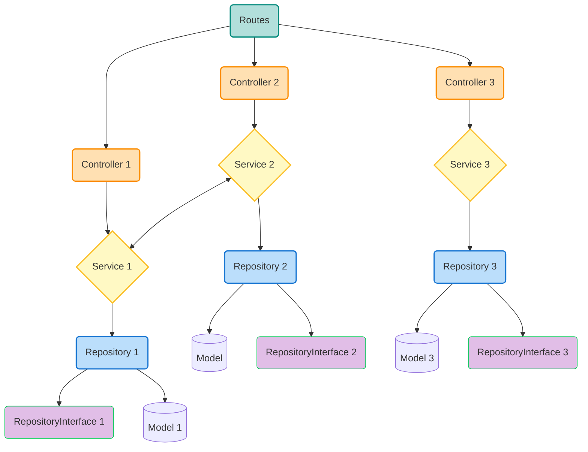

# Challenge Cloud - API

API desenvolvida em Go utilizando arquitetura limpa e GORM. Esta API coleta dados de telemetria como giroscópio, GPS e fotos.

## 🔧 Tecnologias

- Go
- GORM
- Gorilla Mux
- JWT (Auth)

## 🚀 Endpoints

- `POST /telemetry/gyroscope` - Envia dados de giroscópio
- `GET /telemetry/gyroscope` - Retorna dados de giroscópio

- `POST /telemetry/gps` - Envia dados de GPS
- `GET /telemetry/gps` - Retorna dados de GPS

- `POST /telemetry/photo` - Envia foto (jpg/png)
- `GET /telemetry/photo` - Lista fotos

- `POST /login` - Retorna JWT Token

## 📁 Estrutura do Projeto

```
internal/
│
├── config/           # Conexão com banco, variáveis de ambiente
├── controllers/      # Controllers (HTTP layer)
├── services/         # Lógica de negócio
├── repositories/     # Repositórios com acesso ao banco
│   ├── gorm/         # Implementações com GORM
│   └── contracts/    # Interfaces
├── models/           # Structs GORM (Models)
├── router/           # Configuração de rotas
└── seeders/          # Seed de dados iniciais
```

## 🔐 Autenticação

Utiliza JWT com tempo de expiração e validação por middleware. Basta chamar o endpoint `/login` com username/senha. O token retornado deve ser enviado via header `Authorization: Bearer <token>`.

## 🧠 Design Pattern

### Repository Pattern com Service Layer e Contracts

Neste projeto, adotamos o **Repository Pattern** em conjunto com uma **Service Layer** e uso de **contracts (interfaces)**, seguindo o princípio da separação de responsabilidades (SoC - Separation of Concerns).

#### 🔁 Como funciona

- **Rotas** → chamam uma função da **Controller**
- **Controller** → chama um método da **Service**
- **Service** → executa regras de negócio, validações e delega operações de banco ao **Repository**
- **Repository** → acessa os dados através do **ORM (GORM)** usando uma **interface contract**
- **Model** → representa diretamente a estrutura da tabela no banco de dados

A principal vantagem dessa arquitetura é que a aplicação se torna **modular, testável e desacoplada**. Por exemplo, as services só conhecem a interface do repository, o que permite fácil substituição por outro tipo de armazenamento ou mock em testes.

#### 🧬 Diagrama de fluxo



> **Nota**: O uso das interfaces (`contracts`) permite que as camadas superiores conheçam apenas as assinaturas dos métodos, facilitando a **injeção de dependência** e a **testabilidade**.

### 🧱 Model

A `Model` representa uma entidade do banco de dados e serve como base para o GORM criar a estrutura e mapear os dados automaticamente.

 #### model `Gyroscope`:

```go
type Gyroscope struct {
	ID        uint64    `gorm:"primaryKey" json:"id,omitempty" `
	MAC       string    `gorm:"index;not null" json:"mac" validate:"required"`
	X         float64   `gorm:"not null" json:"x" validate:"required"`
	Y         float64   `gorm:"not null" json:"y" validate:"required"`
	Z         float64   `gorm:"not null" json:"z" validate:"required"`
	Timestamp time.Time `gorm:"autoCreateTime" json:"timestamp"`
}
```

 #### model `GPS`:

```go
type GPS struct {
	ID        uint64    `gorm:"primaryKey" json:"id,omitempty"`
	MAC       string    `gorm:"index;not null" json:"mac" validate:"required"`
	Latitude  float64   `gorm:"not null" json:"latitude" validate:"required"`
	Longitude float64   `gorm:"not null" json:"longitude" validate:"required"`
	Timestamp time.Time `gorm:"autoCreateTime" json:"timestamp"`
}
```

 #### model `Photo`:

```go
type Photo struct {
	ID         uint64    `gorm:"primaryKey" json:"id,omitempty"`
	MAC        string    `gorm:"index;not null" json:"mac" validate:"required"`
	ImageURL   string    `gorm:"" json:"image_url"`
	Recognized bool      `gorm:"default:false" json:"recognized"`
	Timestamp  time.Time `gorm:"autoCreateTime" json:"timestamp"`
}
```
