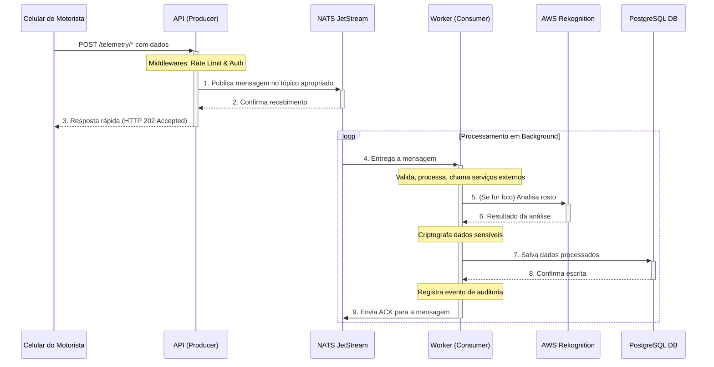

# Desafio Cloud - Solução de Telemetria de Frota

Este projeto é a implementação completa de uma solução de telemetria de frota, construída como parte de um desafio técnico. O sistema é projetado para ingerir, processar e analisar dados de GPS, giroscópio e fotos de veículos de forma assíncrona, segura e escalável, utilizando uma arquitetura de microsserviços.

---

## 🏛️ Arquitetura

A solução é baseada em uma arquitetura de microsserviços desacoplada, utilizando o padrão Producer-Consumer com uma fila de mensagens NATS JetStream para garantir resiliência e escalabilidade.

# 🚚 Solução de Telemetria de Frota

## ✨ Features Implementadas

Este projeto implementa um conjunto robusto de funcionalidades e boas práticas de engenharia de software:

- ✅ API REST para ingestão de 3 tipos de telemetria.
- ✅ Validação de Dados na entrada e no processamento.
- ✅ Arquitetura Assíncrona com Fila de Mensagens (NATS JetStream).
- ✅ Padrão Producer/Consumer com serviços api e worker desacoplados.
- ✅ Integração com IA na Nuvem (AWS Rekognition) para reconhecimento facial.
- ✅ Sistema de Cache em memória para otimização de custos e performance.
- ✅ Persistência de Dados em um banco de dados relacional (PostgreSQL).
- ✅ Containerização Completa com Docker e orquestração com Docker Compose.
- ✅ Pipeline de CI/CD com GitHub Actions para testes e deploy automatizados no Docker Hub.
- ✅ Observabilidade e Monitoramento com Métricas (Prometheus), Dashboards (Grafana) e Alertas (Alertmanager).
- ✅ Segurança de API: Autenticação por Chave de API e Rate Limiting.
- ✅ Criptografia de Dados Sensíveis em repouso (AES-GCM).
- ✅ Trilha de Auditoria para operações críticas.
- ✅ Documentação Completa (Técnica, Operacional, API, Segurança, etc.).

---

## 🛠️ Tecnologias Utilizadas

- **Linguagem:** Go  
- **Banco de Dados:** PostgreSQL  
- **Fila de Mensagens:** NATS JetStream  
- **Containerização:** Docker, Docker Compose  
- **CI/CD:** GitHub Actions  
- **Serviços de Nuvem:** AWS Rekognition  
- **Monitoramento:** Prometheus, Grafana, Alertmanager  
- **Documentação de API:** OpenAPI / Swagger  

---

## 🚀 Como Executar

Para instruções detalhadas de como clonar, configurar o arquivo `.env` e rodar o projeto completo com um único comando, por favor, consulte o nosso:

➡️ **Guia de Operação e Manutenção**

---

## 📚 Documentação Completa

Para um mergulho profundo em cada aspecto do projeto, acesse nossa documentação detalhada:

1. **Arquitetura do Sistema**  
2. **Guia de Operação e Manutenção**  
3. **Procedimentos de Backup e Recuperação**  
4. **Guia de Troubleshooting**  
5. **Guia de Segurança e Boas Práticas**  

📎 Acesse a **Documentação Interativa da API (Swagger UI)** (com o sistema em execução)