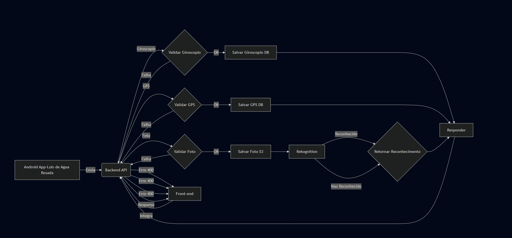
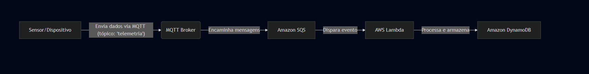

# Telemetry Data Backend API

Este é um backend em Go para receber e processar dados de telemetria (giroscópio, GPS e fotos) enviados por dispositivos móveis. Os dados são armazenados em um banco PostgreSQL e as imagens são analisadas com o AWS Rekognition.

## Getting Started

### Prerequisitos

- Go (versão definida no `go.mod`)
- Docker
- Docker Compose
- Conta AWS com permissões para S3 e Rekognition

### Instalação

1. Clone o repositório (se ainda não tiver feito).
2. Crie um arquivo `.env` na raiz do projeto com as variáveis:

    ```env
    DB_USER=your_db_user
    DB_PASSWORD=your_db_password
    DB_NAME=your_db_name
    DB_HOST=postgres
    DB_PORT=5432
    AWS_REGION=your_aws_region
    AWS_ACCESS_KEY_ID=your_aws_access_key_id
    AWS_SECRET_ACCESS_KEY=your_aws_secret_access_key
    AWS_S3_BUCKET_NAME=telemetry-photos
    ```

### Executando com Docker Compose (Recomendado)

1. Navegue até o diretório raiz do projeto.
2. Execute o comando:

    ```bash
    docker-compose up --build
    ```

A aplicação ficará disponível em `http://localhost:8080`.

### Executando Localmente (Sem Docker)

1. Tenha o PostgreSQL em execução.
2. Exporte as variáveis de ambiente conforme descrito acima.
3. Acesse o diretório `cmd`:

    ```bash
    cd cmd
    ```

4. Rode a aplicação:

    ```bash
    go run main.go
    ```

---

## API Endpoints

- `POST /telemetry/gyroscope`: Recebe dados do giroscópio (`x`, `y`, `z`, `timestamp`, `device_id`).
- `POST /telemetry/gps`: Recebe dados de GPS (`latitude`, `longitude`, `timestamp`, `device_id`).
- `POST /telemetry/photo`: Recebe uma foto (`photo`) com `timestamp` e `device_id`.
Claro! Aqui está um README bem estruturado e profissional para sua API de Telemetria:

---


## 🌐 Base URL

```
http://localhost:8080/api/telemetry
```

---

## 📘 Sumário

* [Endpoints](#endpoints)

  * [POST /gyroscope](#1-post-gyroscope)
  * [POST /gps](#2-post-gps)
  * [POST /photo](#3-post-photo)
* [Formato dos dados](#formato-dos-dados)


---

## 📡 Endpoints

### 1. `POST /gyroscope`

Registra dados de giroscópio.

#### 🧾 Requisição (JSON)

```json
{
  "x": 0.98,
  "y": -0.45,
  "z": 0.12,
  "timestamp": 1715460300,
  "deviceId": "00:0a:95:9d:68:16"
}
```

#### ✅ Resposta

```json
{
  "id": "dc3eac84-2cc5-4269-91ad-5ea2119252c2",
  "device_id": "00:0a:95:9d:68:16",
  "x": 0.98,
  "y": -0.45,
  "z": 0.12,
  "timestamp": "2024-05-11T22:40:00Z",
  "created_at": "2025-05-12T22:53:42.847885711Z"
}
```

---

### 2. `POST /gps`

Registra dados de localização GPS.

#### 🧾 Requisição (JSON)

```json
{
  "latitude": -23.55052,
  "longitude": -46.633308,
  "timestamp": 1715467200,
  "deviceId": "00:0a:95:9d:68:16"
}
```

#### ✅ Resposta

```json
{
  "id": "dc3eac84-2cc5-4269-91ad-5ea2119252c2",
  "device_id": "00:0a:95:9d:68:16",
  "latitude": -23.55052,
  "longitude": -46.633308,
  "timestamp": "2024-05-11T22:40:00Z",
  "created_at": "2025-05-12T22:53:42.847885711Z"
}
```

---

### 3. `POST /photo`

Envia uma foto como parte de um formulário multipart.

#### 🧾 Requisição (`multipart/form-data`)

| Campo       | Tipo               | Descrição                         |
| ----------- | ------------------ | --------------------------------- |
| `photo`     | Arquivo (PNG/JPEG) | Imagem capturada pelo dispositivo |
| `deviceId`  | string             | Identificador do dispositivo      |
| `timestamp` | inteiro (UNIX)     | Tempo do registro da imagem       |

#### 📦 Exemplo com `curl`

```bash
curl -X POST http://localhost:8080/api/telemetry/photo \
  -F "photo=@/caminho/para/imagem.jpg" \
  -F "deviceId=00:0a:95:9d:68:16" \
  -F "timestamp=1715467202"
```

#### ✅ Resposta

```json
{
  "id": "9cc4ab46-3924-4093-99aa-711f95cc8dbe",
  "deviceId": "00:0a:95:9d:68:16",
  "file_path": "00:0a:95:9d:68:16/1715467202.png",
  "recognized": true,
  "timestamp": "2024-05-11T22:40:02Z",
  "created_at": "2025-05-12T22:53:39.130518853Z"
}
```

---

## 🧾 Formato dos dados

| Campo                    | Tipo    | Descrição                            |
| ------------------------ | ------- | ------------------------------------ |
| `deviceId`               | string  | MAC address ou identificador único   |
| `timestamp`              | inteiro | Data/hora em formato UNIX (segundos) |
| `latitude` / `longitude` | float   | Coordenadas geográficas              |
| `x`, `y`, `z`            | float   | Eixos do sensor giroscópio           |
| `photo`                  | arquivo | Imagem em `.png` ou `.jpeg`          |

---


## Docker Compose e Estrutura dos Containers

Este projeto utiliza o Docker Compose para facilitar o ambiente de desenvolvimento. Abaixo está uma explicação detalhada da configuração utilizada.

### docker-compose.yml

```yaml
version: '3.8'

services:
  postgres:
    image: postgres:latest
    container_name: postgres-container
    environment:
      POSTGRES_USER: ${DB_USER}
      POSTGRES_PASSWORD: ${DB_PASSWORD}
      POSTGRES_DB: ${DB_NAME}
    ports:
      - "5432:5432"
    volumes:
      - postgres-data:/var/lib/postgresql/data
      - ./init:/docker-entrypoint-initdb.d
    healthcheck:
      test: ["CMD-SHELL", "pg_isready -U ${DB_USER} -d ${DB_NAME}"]
      interval: 5s
      timeout: 5s
      retries: 5
    networks:
      - telemetry-net

  app:
    build:
      context: .
    container_name: go-app
    depends_on:
      postgres:
        condition: service_healthy
    ports:
      - "8080:8080"
    volumes:
      - .:/app
    working_dir: /app
    command: go run cmd/main.go
    env_file:
      - .env
    networks:
      - telemetry-net

volumes:
  postgres-data:

networks:
  telemetry-net:
````

* `postgres`: inicializa o banco PostgreSQL com os dados da `.env`. Inclui verificação de saúde e volume persistente.
* `app`: constrói e roda a aplicação Go quando o banco estiver pronto.

---

## Dockerfile

```Dockerfile
FROM golang:1.24.3

WORKDIR /app
COPY go.mod go.sum ./
RUN go mod tidy
COPY . .

COPY entrypoint.sh .
RUN chmod +x entrypoint.sh

EXPOSE 8080

ENTRYPOINT ["./entrypoint.sh"]
```

Este Dockerfile:

* Usa imagem oficial do Go.
* Copia as dependências e roda `go mod tidy`.
* Copia o código-fonte e o script `entrypoint.sh`.
* Dá permissão de execução ao script.
* Expõe a porta 8080 e inicia via `entrypoint.sh`.

---

## entrypoint.sh

```bash
#!/bin/bash
echo "Running tests..."
go test -v ./internal/tests/...
TEST_EXIT_CODE=$?
if [ $TEST_EXIT_CODE -ne 0 ]; then
    echo "Tests failed. Exiting."
    exit $TEST_EXIT_CODE
fi
echo "Tests passed. Starting application..."
exec go run cmd/main.go
```

Este script:

* Executa os testes antes de iniciar a aplicação.
* Interrompe a execução se os testes falharem.
* Inicia o servidor se os testes forem bem-sucedidos.


---

## 🧪 Testes Automáticos ao Iniciar o Sistema

Quando o sistema é iniciado, ele executa automaticamente uma série de testes para garantir que os principais componentes e funções estejam funcionando corretamente. Abaixo estão os testes realizados e uma breve descrição de cada um.

### ✅ Testes Executados

#### **Testes do domínio `Device`**

1. **`TestNewDevice/Valid_MAC_address`**
   Valida que um endereço MAC válido é corretamente aceito. Um endereço MAC válido segue o formato hexadecimal (por exemplo, `00:14:22:01:23:45`).

2. **`TestNewDevice/Valid_MAC_with_uppercase`**
   Verifica se o sistema aceita um endereço MAC com letras maiúsculas, como `00:14:22:01:23:45`.

3. **`TestNewDevice/Invalid_MAC_-_too_short`**
   Testa se um endereço MAC com menos de 12 caracteres (como `00:14:22:01`) é rejeitado, já que um endereço MAC deve ter 12 caracteres.

4. **`TestNewDevice/Invalid_MAC_-_wrong_format`**
   Verifica se um endereço MAC com formato incorreto (por exemplo, `0014:2201:2345`) é rejeitado. O formato correto deve ser separado por dois pontos (`:`).

5. **`TestNewDevice/Invalid_MAC_-_non-hex_characters`**
   Testa se um endereço MAC que contém caracteres não hexadecimais (por exemplo, `00:14:22:01:GG:45`) é rejeitado.

6. **`TestNewDevice/Invalid_MAC_-_empty_string`**
   Verifica se uma string vazia fornecida como endereço MAC é rejeitada.

---

#### **Testes de Validação de Endereço MAC**

1. **`TestIsValidMAC/Valid_MAC_address`**
   Valida que um endereço MAC válido é aceito. Verifica o formato e a presença de caracteres hexadecimais.

2. **`TestIsValidMAC/Valid_MAC_with_uppercase`**
   Verifica se o sistema aceita endereços MAC com letras maiúsculas. Isso testa a flexibilidade do sistema ao lidar com diferentes formatos.

3. **`TestIsValidMAC/Valid_MAC_with_lowercase`**
   Valida se endereços MAC com letras minúsculas (como `00:14:22:01:23:45`) são aceitos corretamente.

4. **`TestIsValidMAC/Invalid_MAC_-_too_short`**
   Testa se um endereço MAC com menos de 12 caracteres (por exemplo, `00:14:22:01`) é rejeitado, pois o MAC deve ter 12 caracteres.

5. **`TestIsValidMAC/Invalid_MAC_-_too_long`**
   Verifica se um endereço MAC com mais de 12 caracteres é rejeitado, já que o comprimento do MAC deve ser fixo.

6. **`TestIsValidMAC/Invalid_MAC_-_wrong_separator`**
   Testa se endereços MAC com separadores diferentes de dois pontos (por exemplo, `00-14-22-01-23-45`) são rejeitados.

7. **`TestIsValidMAC/Invalid_MAC_-_non-hex`**
   Verifica se um endereço MAC que contém caracteres não hexadecimais (como `00:14:22:01:ZZ:45`) é rejeitado.

8. **`TestIsValidMAC/Invalid_MAC_-_empty`**
   Valida se um endereço MAC vazio é rejeitado.

---

#### **Testes de Dados de GPS**

1. **`TestNewGPSData/Valid_GPS_data`**
   Testa a aceitação de dados de GPS válidos, como latitude e longitude no formato adequado, juntamente com um identificador de dispositivo válido.

2. **`TestNewGPSData/Invalid_Device_ID`**
   Verifica se o sistema rejeita dados de GPS com um `device_id` inválido, garantindo que apenas dispositivos registrados possam enviar dados.

3. **`TestNewGPSData/Zero_timestamp`**
   Testa se a aplicação aceita dados com um timestamp igual a zero. Isso é importante para garantir que um timestamp inválido (como 0) seja tratado corretamente.

4. **`TestNewGPSData/Invalid_Latitude_(NaN)`**
   Verifica se a latitude com valor "NaN" (não numérico) é rejeitada. A latitude deve ser um número válido entre -90 e 90.

5. **`TestNewGPSData/Invalid_Longitude_(Inf)`**
   Testa se a longitude com valor infinito (`Inf`) é rejeitada, pois valores infinitos não são válidos para coordenadas.

6. **`TestNewGPSData/Invalid_Latitude_out_of_range`**
   Valida se latitudes fora do intervalo permitido (-90 a 90) são rejeitadas. Uma latitude de `100` ou `-100` deve ser rejeitada.

7. **`TestNewGPSData/Invalid_Longitude_out_of_range`**
   Testa se longitudes fora do intervalo permitido (-180 a 180) são rejeitadas. Longitudes como `200` ou `-200` devem ser inválidas.

---

#### **Testes de Dados do Giroscópio**

1. **`TestNewGyroscopeData/Valid_gyroscope_data`**
   Verifica se os dados do giroscópio, como `x`, `y`, `z`, e `timestamp`, são validados corretamente e aceitos como válidos.

2. **`TestNewGyroscopeData/Invalid_Device_ID`**
   Testa se os dados do giroscópio com um `device_id` inválido são rejeitados, para garantir que apenas dispositivos registrados possam enviar esses dados.

3. **`TestNewGyroscopeData/Zero_timestamp`**
   Valida se o timestamp igual a zero é tratado corretamente. Um timestamp de zero pode indicar dados corrompidos ou inválidos.

4. **`TestNewGyroscopeData/Invalid_X_(NaN)`**
   Testa se a coordenada `x` com valor "NaN" (não numérico) é rejeitada, já que valores numéricos válidos são esperados.

5. **`TestNewGyroscopeData/Invalid_Y_(Inf)`**
   Verifica se a coordenada `y` com valor infinito (`Inf`) é rejeitada.

6. **`TestNewGyroscopeData/Invalid_Z_(NaN)`**
   Testa se a coordenada `z` com valor "NaN" é rejeitada.

---

#### **Testes de Dados de Fotos**

1. **`TestNewPhotoData/Valid_Photo_data`**
   Valida se os dados da foto recebidos, incluindo a imagem e as informações de timestamp, são aceitos corretamente.

2. **`TestNewPhotoData/Invalid_Device_ID`**
   Verifica se o `device_id` da foto é válido e se a foto é rejeitada quando o `device_id` não for encontrado ou for inválido.

3. **`TestNewPhotoData/Zero_timestamp`**
   Testa se a foto com timestamp igual a zero é rejeitada, já que isso pode ser considerado um dado inválido ou corrompido.


---
### **Testes de Criação de Dados de GPS**

1. **`TestCreateGPSUseCase_Execute/Successful_GPS_creation`**
   Verifica se a criação de um dado GPS com informações válidas (como `device_id`, `latitude`, `longitude`, etc.) é bem-sucedida.

2. **`TestCreateGPSUseCase_Execute/Invalid_DeviceID`**
   Testa se um `device_id` inválido (ou inexistente) resulta em erro. Apenas dispositivos registrados podem enviar dados de GPS.

3. **`TestCreateGPSUseCase_Execute/Zero_Timestamp`**
   Verifica se um timestamp igual a zero é tratado corretamente. Um timestamp de zero pode ser um valor inválido, e o sistema deve rejeitá-lo.

4. **`TestCreateGPSUseCase_Execute/Invalid_Latitude_(NaN)`**
   Testa se a latitude com valor "NaN" (não numérico) é rejeitada, já que a latitude deve ser um número válido entre -90 e 90.

5. **`TestCreateGPSUseCase_Execute/Repository_error`**
   Verifica se o sistema lida corretamente com erros ao tentar salvar os dados no repositório (por exemplo, se a base de dados falhar ao inserir os dados).

---

### **Testes de Criação de Dados de Giroscópio**

1. **`TestCreateGyroscopeUseCase_Execute/Successful_Gyroscope_creation`**
   Valida se a criação de dados do giroscópio com informações corretas (como `x`, `y`, `z`, e `timestamp`) é bem-sucedida.

2. **`TestCreateGyroscopeUseCase_Execute/Invalid_DeviceID`**
   Verifica se o sistema rejeita dados de giroscópio com um `device_id` inválido.

3. **`TestCreateGyroscopeUseCase_Execute/Zero_Timestamp`**
   Testa se um timestamp igual a zero para dados de giroscópio é rejeitado, garantindo que um timestamp inválido não seja aceito.

4. **`TestCreateGyroscopeUseCase_Execute/Invalid_X_(NaN)`**
   Verifica se o valor `x` do giroscópio, quando for "NaN" (não numérico), é rejeitado.

5. **`TestCreateGyroscopeUseCase_Execute/Invalid_Y_(Inf)`**
   Testa se o valor `y` com valor infinito (`Inf`) é rejeitado, já que valores infinitos não são válidos.

6. **`TestCreateGyroscopeUseCase_Execute/Repository_error`**
   Verifica se o sistema lida corretamente com erros ao tentar salvar os dados do giroscópio no repositório.

---

### **Testes de Criação de Dados de Foto**

1. **`TestCreatePhotoUseCase_Execute/Successful_photo_creation`**
   Verifica se a criação de uma foto com dados válidos (como `device_id`, foto em bytes, timestamp, etc.) é bem-sucedida.

2. **`TestCreatePhotoUseCase_Execute/Invalid_DeviceID`**
   Testa se o sistema rejeita dados de foto com um `device_id` inválido, garantindo que apenas dispositivos válidos possam enviar fotos.

3. **`TestCreatePhotoUseCase_Execute/Zero_Timestamp`**
   Verifica se um timestamp igual a zero em uma foto é rejeitado, evitando que fotos com timestamps inválidos sejam aceitas.

4. **`TestCreatePhotoUseCase_Execute/Empty_Photo_Bytes`**
   Testa se uma foto com bytes vazios (sem conteúdo) é rejeitada, garantindo que o sistema não aceite fotos sem dados.

5. **`TestCreatePhotoUseCase_Execute/AWS_UploadPhoto_error`**
   Verifica se o sistema lida corretamente com erros ao tentar carregar a foto para o serviço de armazenamento (como AWS S3, por exemplo).

6. **`TestCreatePhotoUseCase_Execute/AWS_ComparePhoto_error`**
   Testa se o sistema lida corretamente com erros ao tentar comparar a foto carregada (por exemplo, se uma comparação falhar).

7. **`TestCreatePhotoUseCase_Execute/Repository_Create_error`**
   Verifica se o sistema lida com erros ao tentar salvar a foto no repositório de dados.

8. **`TestCreatePhotoUseCase_Execute/Photo_size_exceeds_5MB`**
   Testa se o sistema rejeita fotos que excedem o limite de 5MB, garantindo que o tamanho da foto seja controlado.

9. **`TestCreatePhotoUseCase_Execute/Unsupported_photo_format`**
   Verifica se o sistema rejeita fotos com formatos não suportados (por exemplo, `.bmp`, `.tiff`), aceitando apenas formatos válidos como `.jpg` ou `.png`.

---

### Resumo

Esses testes são essenciais para garantir que os casos de uso de criação de dados (GPS, giroscópio e foto) no sistema funcionem corretamente em diversos cenários. Eles cobrem tanto o sucesso das operações quanto a manipulação de erros, como dados inválidos ou falhas no repositório e serviços externos (como AWS). Todos os testes passaram (`PASS`), indicando que o sistema está robusto nessas operações.


### Diagram Atual


### Segunda Opção



Nos últimos dias, estive focado em duas apresentações do projeto SUSA,veja o post no LinkedIn [Musseketech Conclave](https://www.linkedin.com/posts/iamrosada_musseketechconclave-inovaaexaeto-educaaexao-activity-7327611871757320192-WZ2p)

Durante essas atividades, demonstrei o sistema, desenvolvido em Go e Next.js ,[assista à apresentação](https://www.youtube.com/watch?v=gqxzIGSFgNw&t=318s)

 sou o jovem de óculos, mostrei o sistema no final. Por conta dessas demandas, pausei a programação por dois dias, o que causou um pequeno atraso na entrega do desafio. Apesar disso, dei meu melhor para cumprir todos os compromissos com qualidade.


